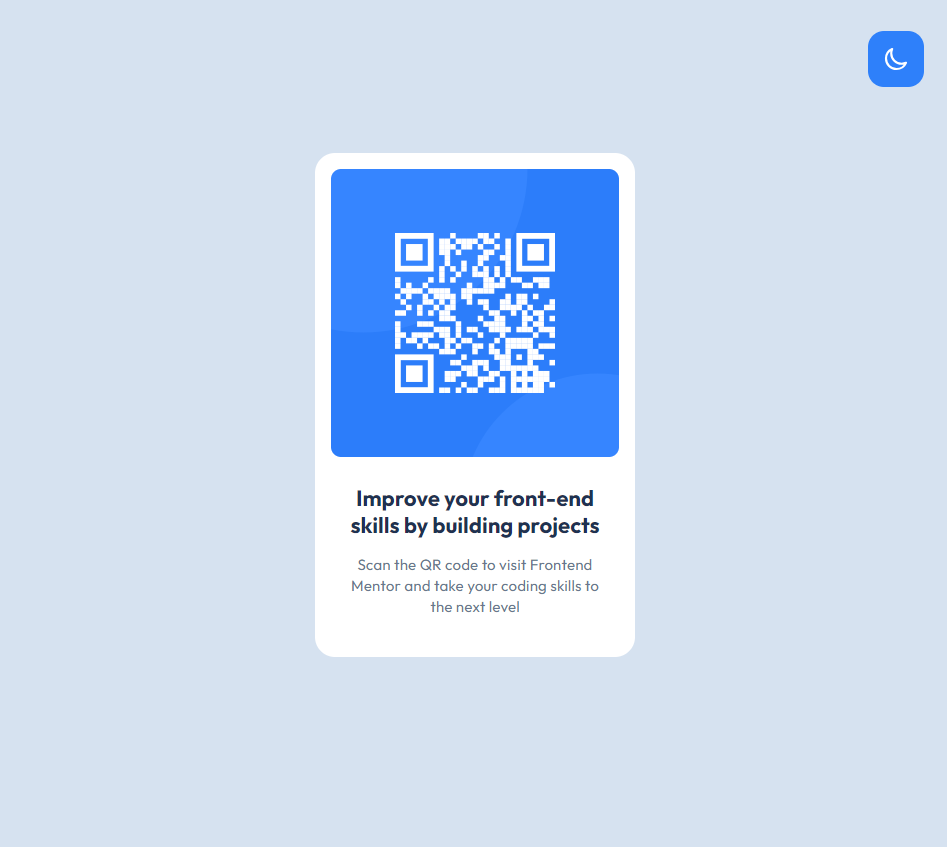
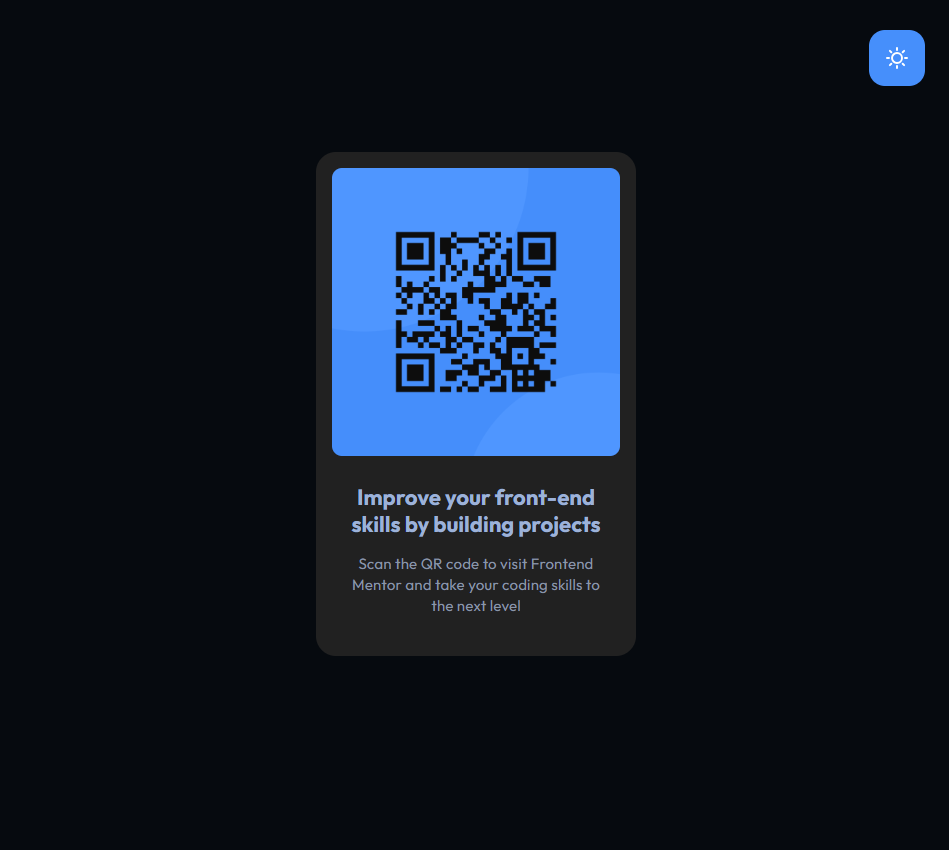

# QR Code Component

This is my solution to the [QR Code Component challenge on Frontend Mentor](https://www.frontendmentor.io/challenges/qr-code-component-iux_sIO_H). Frontend Mentor challenges help you improve your coding skills by building realistic projects.

## Table of contents

- [Overview](#overview)
  - [The challenge](#the-challenge)
  - [Screenshot](#screenshot)
  - [Links](#links)
- [My process](#my-process)
  - [Built with](#built-with)
  - [What I learned](#what-i-learned)
- [Author](#author)

## Overview

### The challenge

The task in this challenge was to build out a QR code component and get it looking as close to the design as possible.

### Screenshot
As an added challenge, I decided to create a theme toggle for this project. I added a separate set of color variables closely related to those for the default theme, and a button to switch between themes:

**Light Theme**

**Dark Theme**

### Links

- Solution URL: [GitHub repo](https://github.com/ashea29/qr-code-component-challenge)
- Live Preview URL: [https://qr-code-component-solution-ajs.netlify.app/](https://qr-code-component-solution-ajs.netlify.app/)

## My process

### Built with

- Vite (Vanilla JS)
- Semantic HTML5 markup
- CSS custom properties
- Flexbox
- Sass mixins

As another added challenge, even though it's blatant overkill for such a simple component, I took the opportunity to build an accessibility checker into my workflow using [pa11y](https://github.com/pa11y/pa11y) and [concurrently](https://github.com/open-cli-tools/concurrently). The intention is to use this, going forward, in future challenges and other projects.

### What I learned
I recently started going through Frontend Mentor's formal learning path in order to get extra practice, solidify concepts and techniques I'm already familiar with, and to learn some new things too! This challenge fell under the category: "review of the skills I already have."

However, I did learn some new things along the way -- mostly from building the accessibility checker. It took some trial and error to get things working properly, and in a way that made sense.

## Author

- Website - [Andrew J Shea | Portfolio](andrewjshea.com)
- Frontend Mentor - [@ashea29](https://www.frontendmentor.io/profile/ashea29)
- GitHub - [ashea29](https://github.com/ashea29)
- LinkedIn - [Andrew J Shea](https://www.linkedin.com/in/andrew-j-shea/)
